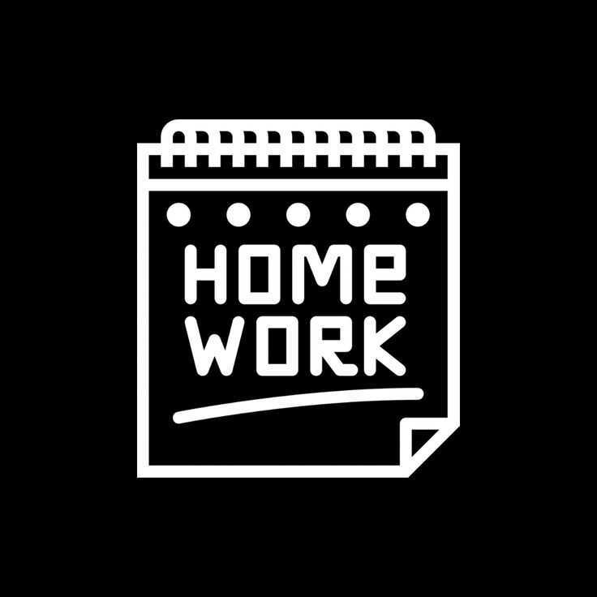

# Homework-schedule

## Submission
Please fill out the form below to submit your homework:

[Homework Submission Form](https://docs.google.com/forms/d/e/1FAIpQLSePaBJknteuxwMRqSUNaENKGFOy2PGlpv3yhvfOGlt56XHmZQ/viewform)

**All Homeworks are due at 9:00AM the morning of the due date**
| Unit 4 Homework  | Due Morning: | 
| ------------------------------------------------------------| :-------------------:|
| [Python Control Flow Lab](https://github.com/SEB-1-Bahrain/Python-Control-Flow-Lab)    | Wed 27/11/24 |

| Unit 3 Homework  | Due Morning: | 
| ------------------------------------------------------------| :-------------------:|
| [Modern Javascript Syntax Lab](https://github.com/SEB-1-Bahrain/Modern-JS-Syntax-Lab)    | Tue 5/11/24 |
| [React Components Lab](https://github.com/SEB-1-Bahrain/React-Components-Lab)    | Wed 6/11/24 |
| [React State Management Lab](https://github.com/SEB-1-Bahrain/React-State-Management-Lab)    | Wed 6/11/24 |
| [Controlled Forms in React Lab](https://github.com/SEB-1-Bahrain/Controlled-Forms-in-React-Lab)    | Sun 10/11/24 |
| [Lifting State in React Lab](https://github.com/SEB-1-Bahrain/Lifting-State-in-React-Lab)    | Mon 11/11/24 |
| [Fetching Data in React Lab](https://github.com/SEB-1-Bahrain/Fetching-Data-in-React-Lab)    | Mon 11/11/24 |
| [React Router DOM Lab](https://github.com/SEB-1-Bahrain/React-Router-DOM-Lab)    | Tue 12/11/24 |
| [Express API: Jukebox Back-End Lab](https://github.com/SEB-1-Bahrain/Express-API-Jukebox-Back-End-Lab)    | Wed 13/11/24 |
| [React: Jukebox Front-End Lab](https://github.com/SEB-1-Bahrain/React-Jukebox-Front-End-Lab)    | Thu 14/11/24 |

| Unit 2 Homework  | Due Morning: | 
| ------------------------------------------------------------| :-------------------:|
| [Intro to Express Lab](https://github.com/SEB-1-Bahrain/intro-to-express-lab)    | Wed 16/10/24 |
| [EJS Lab](https://github.com/SEB-1-Bahrain/w4-d2-EJS-LAB)    | Sun 20/10/24 |
| [MEN Stack Lab](https://github.com/SEB-1-Bahrain/w4-d4-MEN-Stack-LAB)    | Tue 22/10/24 |
| [MEN Stack Cookbook](https://github.com/SEB-1-Bahrain/MEN-Stack-Embedding-Related-Data-Lab-Cookbook)    | Sun 27/10/24 |

| Unit 1 Homework  | Due Morning: | 
| ------------------------------------------------------------| :-------------------:| 
| [JavaScript Functions Lab](https://github.com/SEB-1-Bahrain/DAY-2-intro-javascript-functions-LAB)    | Thu 26/09/24 | 
| [JavaScript Arrays Lab](https://github.com/SEB-1-Bahrain/DAY-3-intro-to-javascript-arrays-LAB)    | Mon 30/09/24 | 
| [JavaScript Objects Lab](https://github.com/SEB-1-Bahrain/intro-js-objects-LAB)    | Tue 01/10/24 | 
| [DOM Events Lab](https://github.com/SEB-1-Bahrain/w2-d1-dom-events-LAB)    | Thu 03/10/24 |
| [Tamagotchi Lab](https://github.com/SEB-1-Bahrain/w2-d2-js-browser-game-tamagotchi-lab)    | Sun 06/10/24 |
| [Flexbox Lab](https://github.com/SEB-1-Bahrain/w2-d4-flexbox-LAB)    | Optional |
| [Array Iterator Lab](https://github.com/SEB-1-Bahrain/W2-D5-array-iterator-LAB)    | Optional |
| [Markdown Lab](https://github.com/SEB-1-Bahrain/W2-D5-LAB-intro-markdown-lab)    | Optional |
